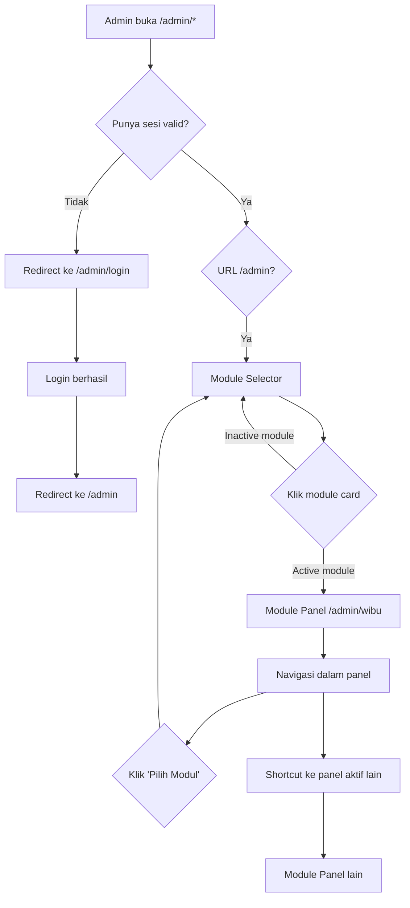
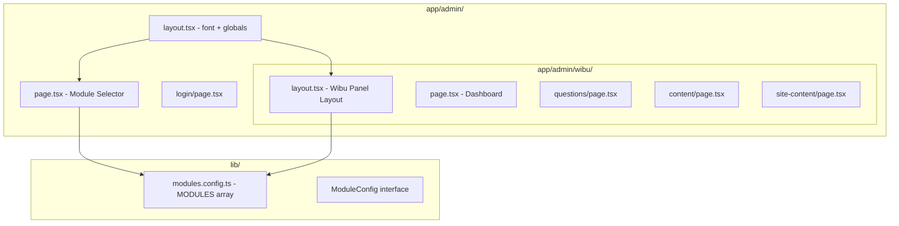

# Design Document: Admin Module Selector

## Overview

Fitur ini menambahkan lapisan pemilihan modul pada Admin Panel (`/admin/*`) platform `seberapakamu.id`. Saat ini setelah login, admin langsung masuk ke satu panel generik (`/admin/dashboard`). Dengan fitur ini, setelah login admin akan landing di **Module Selector** (`/admin`) — sebuah halaman yang menampilkan semua modul platform sebagai kartu yang bisa dipilih.

Setelah memilih modul, admin masuk ke **Module Panel** yang spesifik per modul (contoh: `/admin/wibu`). Semua halaman admin yang sudah ada (questions, content, site-content, dashboard) dipindahkan ke bawah prefix `/admin/wibu/` sebagai bagian dari Module Panel Wibu.

### Tujuan Utama

- Memberikan titik masuk tunggal yang bersih setelah login
- Memisahkan konfigurasi per modul secara visual dan struktural
- Menyediakan arsitektur yang mudah diperluas untuk modul-modul baru di masa depan

---

## Architecture

### Struktur Routing Setelah Implementasi

```
/admin                         → Module Selector (halaman baru, protected)
/admin/login                   → Halaman login (tidak berubah, kecuali redirect target)
/admin/wibu                    → Dashboard Module Panel Wibu (pindah dari /admin/dashboard)
/admin/wibu/questions          → Manajemen soal (pindah dari /admin/questions)
/admin/wibu/content            → Manajemen konten (pindah dari /admin/content)
/admin/wibu/site-content       → Edit halaman (pindah dari /admin/site-content)
```

### Redirect Kompatibilitas (di `next.config.ts`)

```
/admin/dashboard    → /admin/wibu       (permanent redirect)
/admin/questions    → /admin/wibu/questions
/admin/content      → /admin/wibu/content
/admin/site-content → /admin/wibu/site-content
```

### Alur Navigasi



### Layer Arsitektur



---

## Components and Interfaces

### `ModuleConfig` Interface

Didefinisikan di `lib/modules.config.ts`:

```typescript
export interface ModuleConfig {
  slug: string;           // URL segment: "wibu", "bucin", dll.
  name: string;           // Nama tampilan: "Seberapa Wibu Kamu?"
  description: string;    // Deskripsi singkat modul
  emoji: string;          // Ikon representasi: "🌸"
  color: string;          // Warna identitas modul: "#ff6b9d"
  status: 'active' | 'coming_soon';
}

export const MODULES: ModuleConfig[] = [
  {
    slug: 'wibu',
    name: 'Seberapa Wibu Kamu?',
    description: 'Ukur tingkat kewibuan kamu dengan kuis interaktif',
    emoji: '🌸',
    color: '#ff6b9d',
    status: 'active',
  },
  {
    slug: 'bucin',
    name: 'Seberapa Bucin Kamu?',
    description: 'Seberapa dalam kamu jatuh cinta?',
    emoji: '💕',
    color: '#ff9999',
    status: 'coming_soon',
  },
  {
    slug: 'introvert',
    name: 'Seberapa Introvert Kamu?',
    description: 'Ukur skala introvert vs ekstrovert kamu',
    emoji: '🌙',
    color: '#9b59b6',
    status: 'coming_soon',
  },
];
```

### `ModuleCard` Component

Komponen kartu di Module Selector. Sepenuhnya dikontrol oleh `ModuleConfig`:

**Props:**
```typescript
interface ModuleCardProps {
  module: ModuleConfig;
  reviewCount?: number;  // Badge notifikasi (opsional, default 0)
}
```

**Behavior:**
- `status: 'active'` → kartu clickable, navigasi ke `/admin/[slug]`
- `status: 'coming_soon'` → kartu disabled (pointer-events: none), badge "Belum Tersedia"
- `reviewCount > 0` → tampilkan badge angka di pojok kanan atas kartu

### `app/admin/page.tsx` — Module Selector Page

Server component, protected. Struktur:
- `createServerClient()` → `getUser()` → redirect ke `/admin/login` jika tidak ada sesi
- Render grid dari `MODULES.map(module => <ModuleCard module={module} />)`
- Header dengan tombol logout

### `app/admin/wibu/layout.tsx` — Wibu Panel Layout

Client/Server component, shared di semua halaman wibu. Berisi:
- Header dengan nama modul aktif ("🌸 Seberapa Wibu Kamu?")
- Link "← Pilih Modul" kembali ke `/admin`
- Sidebar/nav horizontal: Dashboard · Pertanyaan · Konten Blog · Edit Halaman
- Shortcut ke panel modul aktif lain (jika ada)
- `AdminLogoutButton`

---

## Data Models

### Static Configuration (bukan database)

Data modul adalah konfigurasi statis di `lib/modules.config.ts`, bukan tabel database. Keputusan ini diambil karena:
- Modul baru membutuhkan kode baru (routes, halaman), bukan hanya data
- Tidak ada admin UI untuk menambah modul secara dinamis
- Konfigurasi statis lebih mudah di-type-check dan di-deploy

### ReviewCount (opsional, future enhancement)

Untuk badge notifikasi (Requirement 6.3), data diambil dari query yang sudah ada:
- Modul Wibu: hitung draft articles dari tabel `articles`
- Bisa di-extend per modul di masa depan

### Auth Model (tidak berubah)

Tetap menggunakan Supabase Auth:
- Server components: `createServerClient()` dari `lib/supabase.server`
- Client components: `createBrowserClient()` dari `lib/supabase`
- Sesi dikelola oleh Supabase, tidak ada perubahan pada token/cookie management

---

## Correctness Properties

*A property is a characteristic or behavior that should hold true across all valid executions of a system — essentially, a formal statement about what the system should do. Properties serve as the bridge between human-readable specifications and machine-verifiable correctness guarantees.*

### Property 1: Module Selector merender semua modul yang dikonfigurasi

*For any* array `ModuleConfig[]` yang valid, komponen Module Selector harus merender tepat sebanyak jumlah modul dalam array tersebut sebagai Module Card, tanpa perubahan kode pada komponen.

**Validates: Requirements 1.2, 7.2**

---

### Property 2: Module Card menampilkan data modul dengan benar

*For any* `ModuleConfig` yang valid, merender Module Card harus menghasilkan output yang mengandung nilai `name`, `description`, `emoji`, dan indikator status modul tersebut.

**Validates: Requirements 1.3, 6.2**

---

### Property 3: Active module card menghasilkan URL navigasi yang benar

*For any* `ModuleConfig` dengan `status: 'active'`, URL navigasi yang dihasilkan oleh Module Card harus sama dengan `/admin/${module.slug}`.

**Validates: Requirements 1.4, 2.1**

---

### Property 4: Inactive module card selalu disabled dan berlabel "Belum Tersedia"

*For any* `ModuleConfig` dengan `status: 'coming_soon'`, Module Card harus memiliki atribut disabled (tidak dapat diklik) dan menampilkan teks "Belum Tersedia".

**Validates: Requirements 1.5, 7.4**

---

### Property 5: Panel layout menampilkan nama modul aktif

*For any* `ModuleConfig` yang valid, merender Wibu Panel Layout dengan modul tersebut harus menghasilkan output yang mengandung `module.name` di area header atau navigasi.

**Validates: Requirements 2.3, 3.3**

---

### Property 6: Panel layout selalu menyertakan link kembali ke Module Selector

*For any* halaman di dalam Module Panel Wibu, layout harus merender elemen navigasi yang mengandung href ke `/admin`.

**Validates: Requirements 3.1**

---

### Property 7: Panel layout merender shortcut ke semua modul aktif

*For any* daftar `ModuleConfig[]`, merender panel layout harus menghasilkan link ke setiap modul dengan `status: 'active'` di daftar tersebut.

**Validates: Requirements 3.4, 3.5**

---

### Property 8: Semua route /admin/* unauthenticated diredirect ke login

*For any* URL yang dimulai dengan `/admin/` (termasuk `/admin`), ketika tidak ada sesi autentikasi yang valid, server harus mengembalikan redirect ke `/admin/login`.

**Validates: Requirements 1.7, 4.1, 4.5**

---

## Error Handling

### Akses Tanpa Autentikasi

- **Server components** (`/admin`, `/admin/wibu`, dll.): `createServerClient()` → `getUser()` → `redirect('/admin/login')` jika `user === null`
- **Client components** (pages yang ada): `createBrowserClient()` → `getUser()` → `router.push('/admin/login')`
- Ini adalah pola yang sudah ada dan konsisten diterapkan ke semua halaman baru

### Akses ke Slug Modul yang Tidak Dikenal

- URL `/admin/[slug]` yang tidak ada di `MODULES` → return 404 (`notFound()` dari `next/navigation`)
- Implementasi via `app/admin/[slug]/page.tsx` yang cek `MODULES.find(m => m.slug === slug)`

### Akses ke Modul Inactive

- URL `/admin/[slug]` untuk modul dengan `status: 'coming_soon'` → `redirect('/admin?info=coming-soon')`
- Module Selector dapat menampilkan banner info jika ada query param tersebut

### Session Expired di Dalam Panel

- Supabase auth middleware sudah menangani refresh token secara otomatis
- Jika sesi benar-benar expired dan tidak bisa di-refresh: redirect ke `/admin/login?redirect=/admin/wibu/questions` (contoh)
- Param `redirect` di-read oleh login page untuk redirect balik setelah login

### Redirect Backward Compatibility

- URL lama (`/admin/dashboard`, `/admin/questions`, dll.) dikonfigurasikan di `next.config.ts` sebagai permanent redirect (308)
- Jika konfigurasi redirect hilang/salah, URL lama akan return 404 (acceptable, tidak ada user eksternal yang menggunakan URL admin)

---

## Testing Strategy

### Dual Testing Approach

Fitur ini mencakup logika konfigurasi-driven rendering yang cocok untuk property-based testing, serta skenario navigasi konkret yang cocok untuk example-based testing.

### Property-Based Testing

**Library yang digunakan:** `fast-check` (sudah umum di ekosistem TypeScript/Jest/Vitest)

**Konfigurasi:** Minimum 100 iterasi per property test.

**Generator yang dibutuhkan:**
```typescript
// Arbitrary untuk ModuleConfig
const moduleConfigArb = fc.record({
  slug: fc.stringMatching(/^[a-z][a-z0-9-]*$/),
  name: fc.string({ minLength: 1 }),
  description: fc.string({ minLength: 1 }),
  emoji: fc.string({ minLength: 1, maxLength: 4 }),
  color: fc.stringMatching(/^#[0-9a-f]{6}$/i),
  status: fc.oneof(fc.constant('active'), fc.constant('coming_soon')),
});

const activeModuleArb = moduleConfigArb.filter(m => m.status === 'active');
const inactiveModuleArb = moduleConfigArb.filter(m => m.status === 'coming_soon');
const moduleListArb = fc.array(moduleConfigArb, { minLength: 1, maxLength: 10 });
```

**Property Tests yang diimplementasikan** (satu test per property):

- **Feature: admin-module-selector, Property 1:** Module Selector merender semua modul yang dikonfigurasi
- **Feature: admin-module-selector, Property 2:** Module Card menampilkan data modul dengan benar
- **Feature: admin-module-selector, Property 3:** Active module card menghasilkan URL navigasi yang benar
- **Feature: admin-module-selector, Property 4:** Inactive module card selalu disabled dan berlabel "Belum Tersedia"
- **Feature: admin-module-selector, Property 5:** Panel layout menampilkan nama modul aktif
- **Feature: admin-module-selector, Property 6:** Panel layout selalu menyertakan link kembali ke Module Selector
- **Feature: admin-module-selector, Property 7:** Panel layout merender shortcut ke semua modul aktif

### Example-Based Tests

Skenario konkret yang perlu dicover dengan unit/integration test:

1. **Login redirect**: Setelah `signInWithPassword` berhasil, `router.push` dipanggil dengan `/admin` (bukan `/admin/dashboard`)
2. **Auth guard Module Selector**: `app/admin/page.tsx` memanggil `redirect('/admin/login')` ketika `getUser()` returns `null`
3. **Auth guard Module Panel**: `app/admin/wibu/layout.tsx` atau page melakukan redirect saat tidak terautentikasi
4. **Konfigurasi MODULES default**: `MODULES` array mengandung modul dengan `slug: 'wibu'` dan `status: 'active'`
5. **Redirect config**: `next.config.ts` memiliki redirect mapping dari URL lama ke URL baru
6. **Akses slug tidak dikenal**: Mengakses `/admin/tidak-ada` mengembalikan 404

### Unit Tests Fokus

- Murni pada logika komponen, bukan pada routing Next.js
- Komponen utama: `ModuleCard`, `ModuleSelectorPage` (render output), `WibuPanelLayout` (nav links)
- Gunakan React Testing Library + jsdom

### Smoke Tests (Manual atau CI)

- Struktur direktori sesuai dengan target (semua halaman ada di `/admin/wibu/*`)
- Redirect URL lama berfungsi di environment staging
- Tidak ada regresi fungsionalitas di halaman wibu yang sudah ada
- Aksesibilitas dasar (keyboard navigation, focus indicator, kontras)
